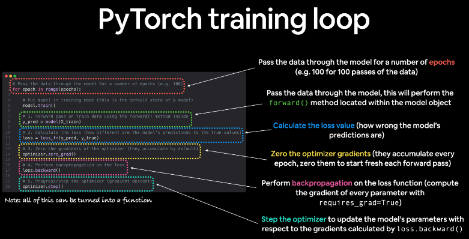

# Regression
building a simple linear regression model using Pytorch.

## Introduction

- Regression is a statistical method used in finance, investing, and other disciplines that attempts to determine the strength and character of the relationship between one dependent variable (usually denoted by Y) and a series of other variables (known as independent variables).

## Pytorch Flow

1. Load Data
2. Make Dataset Iterable
3. Create Model Class
4. Instantiate Model Class
5. Instantiate Loss Class
6. Instantiate Optimizer Class
7. Train Model
8. Evaluate Model
9. Save Model
10. Load Model for Inference

## Pytorch Classes

- `torch.nn` -> contains the building blocks for creating all sorts of neural network architectures and computational graphs.

- `torch.nn.Parameter` -> A kind of Tensor that is to be considered a module parameter. By adding a Parameter to a Module, its `data` is automatically added to the list of its parameters. We can then use `autograd` to find the gradients of the parameters with respect to some loss function.

- `torch.nn.Module` -> Base class for all neural network modules. Your models should also subclass this class.

- `torch.nn.optim` -> Contains optimizers which are used to update the weights of the neural network.

- `torch.nn.functional` -> Contains all the functions in the torch.nn library.

## Pytorch Training Loop

steps in training loop:

- `Forward Pass`: Compute predicted outputs by passing inputs to the model.
- `Loss Calculation`: Calculate the loss.
- `Backward Pass`: Compute gradient of the loss with respect to model parameters.
- `Optimizer Step`: Take a step with the optimizer to update the model parameters.

```python
for epoch in range(num_epochs):
    model.train()

    y_pred = model(x_data)

    loss = criterion(y_pred, y_data)

    optimizer.zero_grad()

    loss.backward()

    optimizer.step()
``` 



## Inferece

1. Load Model
2. Set Model to Evaluation Mode
3. Make Predictions

```python
model = LinearRegression(input_dim, output_dim)`
model.load_state_dict(torch.load('model.ckpt'))
model.eval()

predicted = model(torch.from_numpy(x_test).float()).detach().numpy()
``` 

## Saving and Loading Model

- `torch.save(model.state_dict(), 'model.ckpt')` -> Save model state dictionary to file.
- `torch.load('model.ckpt')` -> Load model state dictionary from file.
- `model.load_state_dict(torch.load('model.ckpt'))` -> Load model state dictionary from file.